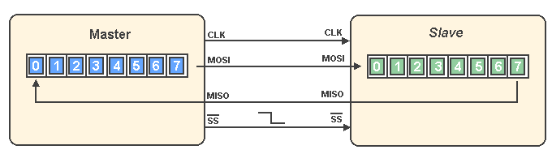

Here’s a uniquely rewritten version of your README that preserves the technical detail but improves clarity, originality, and tone while making it more reader-friendly:

---

# SPI Slave with Integrated Single-Port RAM



## 🚀 Project Summary

This repository features a full hardware design for SPI communication using Verilog. It implements an **SPI Slave module**, a **single-port synchronous RAM**, and a **wrapper module** that seamlessly integrates both components for smooth data handling over SPI.

## 🔧 About SPI

**SPI (Serial Peripheral Interface)** is a high-speed, full-duplex communication protocol often used in embedded systems for device-to-device communication. It operates with four primary signals:

* **MOSI (Master Out, Slave In)** – Transfers data from master to slave.
* **MISO (Master In, Slave Out)** – Sends data from slave to master.
* **SCLK (Serial Clock)** – Synchronizes data transmission; generated by the master.
* **SS/CS (Slave Select/Chip Select)** – Selects the target slave device.

## 🧩 Module Breakdown

### 📁 `SPI_SLAVE.v`

Implements the slave-side of the SPI protocol.

| Signal     | Direction | Width  | Purpose                            |
| ---------- | --------- | ------ | ---------------------------------- |
| `MOSI`     | Input     | 1-bit  | Serial data from the master        |
| `tx_valid` | Input     | 1-bit  | Signals valid transmission data    |
| `tx_data`  | Input     | 8-bit  | Parallel data to transmit          |
| `rst_n`    | Input     | 1-bit  | Active-low reset                   |
| `clk`      | Input     | 1-bit  | Clock signal                       |
| `MISO`     | Output    | 1-bit  | Serial output to the master        |
| `rx_valid` | Output    | 1-bit  | Indicates valid received data      |
| `rx_data`  | Output    | 10-bit | Parallel data received from master |

---

### 📁 `RAM.v`

Implements a single-port memory that responds to decoded SPI commands.

| Parameter   | Description               |
| ----------- | ------------------------- |
| `MEM_DEPTH` | Default memory depth: 256 |
| `ADDR_SIZE` | Address size: 8 bits      |

| Signal     | Direction | Width  | Purpose                                    |
| ---------- | --------- | ------ | ------------------------------------------ |
| `din`      | Input     | 10-bit | Input data combining command and payload   |
| `clk`      | Input     | 1-bit  | Clock signal                               |
| `rst_n`    | Input     | 1-bit  | Active-low reset                           |
| `rx_valid` | Input     | 1-bit  | Triggers operation based on `din[9:8]`     |
| `dout`     | Output    | 8-bit  | Output data                                |
| `tx_valid` | Output    | 1-bit  | High when a read operation's data is ready |

---

### 📁 `SPI_Wrapper.v`

Bridges the SPI interface and the memory module, handling command decoding and routing.

---

## 🔄 SPI Operation Phases

### 1️⃣ Write Address

The master sends an address with command bits `00`, which is stored internally in RAM as the target write address.


---

### 2️⃣ Write Data

Next, the master sends actual data with command bits `01`. RAM writes this data to the previously stored address.


---

### 3️⃣ Read Address

A read address command (`10`) is sent to specify which memory location to read from.


---

### 4️⃣ Read Data

Finally, the master sends a read command (`11`). RAM outputs the data from the read address, which is serialized and sent via `MISO`.


---

## 🧪 Testing and Simulation

* **Simulation Setup**: A `.do` file is included for quick simulation configuration.
* **Testbench**: The `SPI_Wrapper_tb.v` testbench covers all major scenarios: writing, reading, and edge conditions.
* **Documentation**: Inline comments explain all modules clearly.

---

## 📁 Folder Structure

```
SPI_Project/
│
├── Constraints_File/
├── DO_File/
├── Documentation_PDF/
├── Images/
├── Netlist_File/
├── RTL_Code/
├── Run_file/
├── Schematics/
├── Simulation/
└── README.md
```

